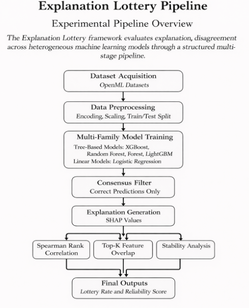

# Research Methodology Overview: The Explanation Lottery

## Overview

This document provides a technical overview of the experimental methodology used to investigate the **Explanation Lottery** phenomenon — the systematic disagreement between model explanations despite identical predictive behavior.

The experimental pipeline is designed to isolate explanation variability from predictive performance and quantify disagreement across heterogeneous machine learning model families using a controlled, reproducible evaluation framework.

The methodology emphasizes:

* model-agnostic evaluation,
* cross-family comparison,
* statistical rigor,
* reproducibility, and
* practitioner-oriented reliability assessment.

---

## 1. Research Motivation and Objectives

Modern machine learning systems increasingly rely on post-hoc explanation methods to justify model predictions in high-stakes domains such as finance, healthcare, and safety-critical systems. However, explanation methods are often evaluated assuming explanation consistency across models.

This project challenges that assumption by investigating the **Explanation Lottery**, defined as:

> A phenomenon where multiple models produce identical or equally correct predictions for a given instance but provide contradictory feature importance explanations.

The primary objectives of this work are:

* To quantify the extent of explanation disagreement across model families.
* To isolate explanation variability independent of predictive accuracy.
* To measure explanation robustness using statistical metrics.
* To evaluate explanation reliability in realistic deployment conditions.
* To propose a reliability assessment framework for explanation stability.

The study focuses specifically on **SHAP-based explanations** due to their widespread adoption and theoretical grounding in cooperative game theory.

---

## 2. Experimental Design Principles

The experimental pipeline is constructed based on the following design principles:

### Prediction–Explanation Separation

Explanation disagreement is studied independently from prediction errors by restricting analysis to instances where all models produce correct predictions.

### Model Diversity

Heterogeneous model families are used to represent fundamentally different learning paradigms, ensuring meaningful explanation variation.

### Dataset Diversity

Multiple datasets from different domains are used to evaluate the generality of the phenomenon.

### Reproducibility

All experiments follow deterministic procedures with fixed random seeds and automated pipelines.

### Statistical Robustness

Multiple quantitative metrics are used to capture different dimensions of explanation disagreement.

---

## 3. Experimental Pipeline

The project follows a modular five-phase pipeline.

---

### Phase I: Data Acquisition and Preprocessing

This phase prepares diverse datasets to ensure consistent experimental conditions.

#### Dataset Collection

* Twenty publicly available datasets are retrieved from **OpenML**.
* Datasets span multiple domains including healthcare, finance, software engineering, and cybersecurity.
* Selection prioritizes tabular classification problems with heterogeneous feature types.

#### Preprocessing Steps

* Automatic encoding of categorical variables.
* Handling of missing values where applicable.
* Feature standardization for scale-sensitive models.
* Stratified train/test partitioning to preserve class distributions.
* Deterministic preprocessing to ensure experiment reproducibility.

The objective of this phase is to eliminate confounding factors unrelated to model behavior.

---

### Phase II: Multi-Family Model Training

This phase trains diverse model families to represent different hypothesis classes.

#### Model Families

**Tree-Based Models**

* XGBoost
* LightGBM
* CatBoost
* Random Forest

These models capture nonlinear relationships and feature interactions.

**Linear Models**

* Regularized Logistic Regression

This model provides a fundamentally different decision structure based on linear separability.

#### Training Procedure

* Hyperparameters selected to achieve strong predictive performance.
* Consistent training protocols across datasets.
* Accuracy levels representative of real-world deployment scenarios.

The objective is to simulate realistic conditions where multiple high-performing models coexist.

---

### Phase III: Consensus Filtering — The Explanation Lottery Mechanism

This phase isolates explanation disagreement from prediction correctness.

#### Consensus Instance Selection

* The test set is filtered to identify instances where **all models produce correct predictions**.
* These instances form the *consensus set*.

This ensures that explanation differences cannot be attributed to prediction failure.

#### Explanation Generation

* SHAP values are computed for each model on consensus instances.
* Feature importance vectors are extracted.
* Explanations are standardized for cross-model comparison.

This step creates the core dataset for disagreement analysis.

---

### Phase IV: Quantitative Disagreement Metrics

Explanation disagreement is evaluated using multiple complementary metrics.

#### Rank-Based Agreement

**Spearman Rank Correlation (ρ)**

* Measures similarity in feature importance rankings.
* Captures global ordering agreement.

#### Feature Selection Agreement

**Top-K Feature Overlap**

* Evaluates agreement among most influential features.
* Tested for K in {3, 5, 10}.
* Reflects practitioner-relevant interpretability.

#### Stability and Robustness Analysis

* Within-family comparison (Tree vs Tree).
* Cross-family comparison (Tree vs Linear).
* Variance analysis of explanation vectors.

These metrics provide a multidimensional assessment of explanation reliability.

---

### Phase V: Visualization and Insight Generation

This phase converts quantitative findings into interpretable outputs.

* Generation of publication-quality visualizations.
* Statistical summary of disagreement patterns.
* Cross-dataset comparison of explanation stability.
* Construction of a prototype **Reliability Score** for explanation trustworthiness.
* Analysis of practical implications for model interpretability.

All visual outputs are generated using reproducible scripts.

---

## 4. Reliability Assessment Framework

The study introduces a prototype reliability evaluation mechanism that quantifies explanation consistency across models.

The framework estimates:

* explanation agreement probability,
* cross-model stability,
* robustness under model variation.

This provides practitioners with a measurable indicator of explanation trustworthiness.

---

## 5. Key Findings

Across datasets and model families, the experimental pipeline consistently reveals:

* strong predictive agreement across models,
* substantial explanation disagreement despite identical predictions,
* systematic divergence between linear and nonlinear model explanations.

Approximately **35% of consensus instances** exhibit significant explanation disagreement.
This phenomenon is defined as the **Explanation Lottery Rate**.

These findings suggest that explanation reliability cannot be assumed solely from predictive performance.

---

## 6. Implications

The results highlight important implications for interpretable machine learning:

* explanation methods may lack stability across model choices,
* model interpretability should include reliability assessment,
* explanation validation must consider cross-model consistency,
* explanation trustworthiness requires quantitative evaluation.

The proposed methodology provides a reproducible framework for studying explanation stability in machine learning systems.

---

## Further Documentation
*   **[Setup and Run Guide](./run_guide.md)**
*   **[Detailed Project Structure](./project_structure.md)**
*   **[Research Repo README](../README.md)**
